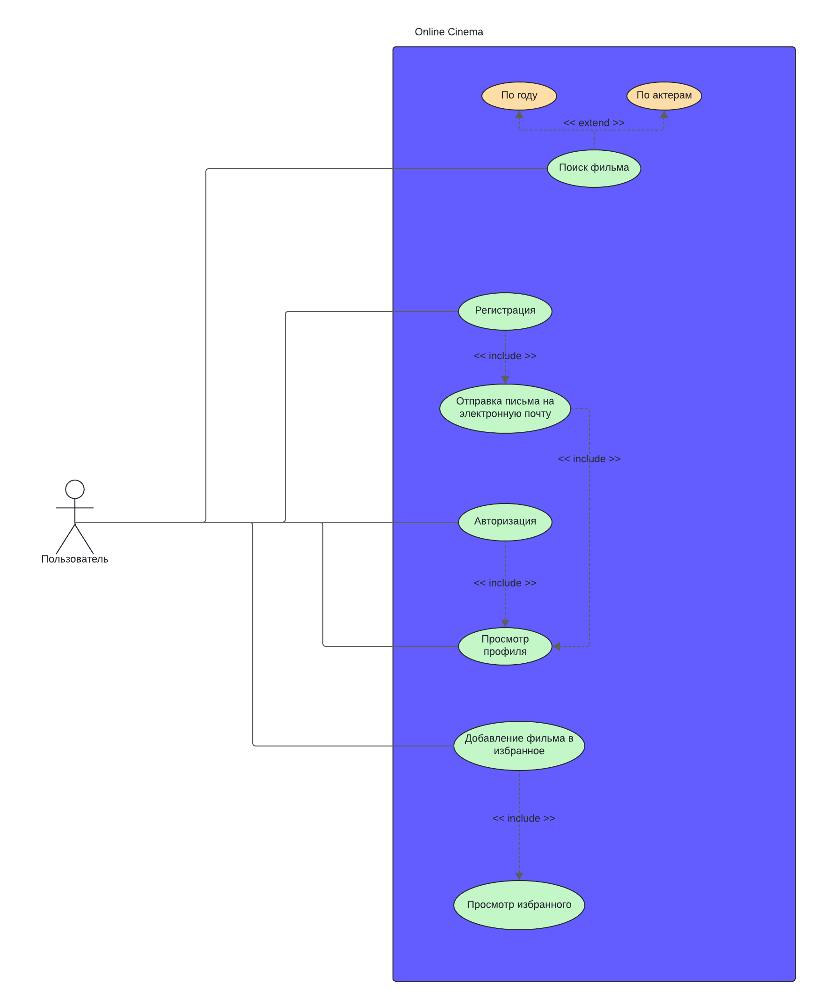

# Vibix - ONLINE CINEMA

## 1. Тема

Vibix - это украинская платформа, представляющая собой онлайн кинотеатр, созданный для предоставления пользователям удобного доступа к коллекции фильмов. Этот проект является дипломной работой для ITStep и демонстрирует мои навыки веб-разработки на основе современных технологий.

## 2. UseCase диаграмма

## 2.1. Список функциональностей

- Собственный дизайн
- Смена темы и локализации
- Главная страница, страница фильмов, категорий и каждого отдельного фильма, поиск, страница регистрации авторизации, профиль пользователя, список избранного, пользовательские соглашения
- TMDB API,
- Поиск по параметрам (название, автор, жанр, год, актёры)
- Система аккаунтов,

## 3. Интерфейс

[Макет Figma](https://www.figma.com/design/FUrbKPfoCkIobVoMg7KVoN/Vibix?node-id=0-1&t=hgwnDMH69Ln7alAQ-1)

## 4. Структура

Веб-приложение.

Интерфейс написан на HTML и CSS с использованием препроцессора Sass.
Весь функционал написан на фреймворке React. Список фильмов выводится в приложении с помощью TMDB API.

## 5. Используемые технологии

**Технологии**
- Языки
	- HTML
	- CSS
	- JS
- Фреймворки/препроцессоры
	- Sass
		- Диалект SCSS
	- React
		- react-router-dom
		- react portal api
		- react-redux
		- react-query
		- axios
- Вспомогательные системы
	- TMDB API
- Инструменты разработки
	- Figma
	- БЭМ-методология
	- Сборщик проектов Vite
	- Редактор кода VS Code
	- Система контроля версий Git и хостинг Github
	- ChatGPT

